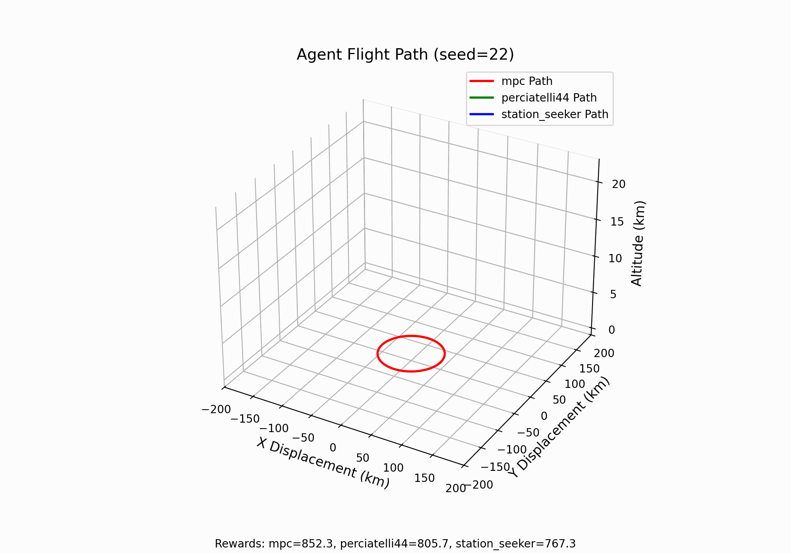

# Balloon Learning Environment
[Docs][docs]

<div align="center">
  
  <br><br>
</div>

The Balloon Learning Environment (BLE) is a simulator for stratospheric
balloons. It is designed as a benchmark environment for deep reinforcement
learning algorithms, and is a followup to the Nature paper
["Autonomous navigation of stratospheric balloons using reinforcement learning"](https://www.nature.com/articles/s41586-020-2939-8).





## Mac Installation

```
git clone --branch python3.9 git@github.com:sdean-group/atmosnav.git
cd balloon-learning-environment/ # this repository already cloned
conda create --name ble python=3.9
conda activate ble
pip install --upgrade pip
pip install balloon_learning_environment
pip install --no-deps -e ../atmosnav
```

## Evaluate MPC Agent

Can also add --renderer=matplotlib to show live animation

```
JAX_ENABLE_X64=True python -m balloon_learning_environment.eval.eval   --agent=mpc --suite=micro_eval --output_dir=/tmp/ble/eval --feature_constructor=mpc

JAX_ENABLE_X64=True python -m balloon_learning_environment.eval.eval   --agent=mpc2 --suite=micro_eval --output_dir=/tmp/ble/eval --feature_constructor=mpc2

JAX_ENABLE_X64=True python -m balloon_learning_environment.eval.eval   --agent=perciatelli44 --suite=micro_eval --output_dir=/tmp/ble/eval --feature_constructor=perciatelli
```

## g2 Installation

```
git clone --branch python3.9 git@github.com:sdean-group/atmosnav.git
git clone git@github.com:sdean-group/balloon-learning-environment.git
cd balloon-learning-environment/
conda create --name ble python=3.9
conda activate ble
conda install jupyter
pip install -f https://storage.googleapis.com/jax-releases/jax_releases.html jaxlib==0.3.0
pip install -f https://storage.googleapis.com/jax-releases/jax_releases.html jax==0.3.0
pip install setuptools==65.5.0
pip install pip==23.2
pip install wheel==0.38.0
curl -O https://files.pythonhosted.org/packages/4b/48/920cea66177b865663fde5a9390a59de0ef3b642ad98106ac1d8717d7005/gym-0.21.0.tar.gz 
pip install gym-0.21.0.tar.gz
pip install -r requirements.txt
pip install --no-deps -e ../atmosnav
```


Make sure to use the updated readme that has jax==0.3.0, jaxlib==0.3.0, gym==0.21.0 commented out. PyPi no longer has these versions of JAX and for some reason pip attempts to install a newer version of gym, so these instructions install the right version in the folder.

## Setting up g2 jupyter notebook
Once `ble` conda environment is fully configured (see above), proceed with these steps: 

First, add the following line to the end of `./bashrc`\
`export PATH=/share/apps/anaconda3/2021.05/bin:$PATH`

Then, on local machine, type: (can also be -01, -02, or -05)\
`ssh netid@g2-login-05.coecis.cornell.edu -L PORT:NODE:PORT`\
where PORT is a random integer between 8000 and 10000 and NODE is selected from {dean-cpu-01 or dean-compute-01}

Then, on g2 login node, type the following and replace NODE with the NODE you selected above:\
```
conda activate ble # on login server
srun -p default_partition --pty --mem=2000 --nodelist=NODE /bin/bash
```

On g2 node after you login (which directly follows the step above), type the line below and replace "use_your_netid" with your NetID.\
```
XDG_RUNTIME_DIR=/tmp/use_your_netid jupyter-notebook --ip=0.0.0.0 --port=PORT
```

Finaly, find a line similar to the string below on your g2 terminal print-out:\
`http://127.0.0.1:PORT/?token=LONG_ALPHANUMERIC_STRING_FROM_JUPYTER-NOTEBOOK_OUTPUT`

Copy `127.0.0.1:PORT` with `PORT` replaced and paste it on your local browser. Use the string after `token` as your "login password".


## Getting Started

Note: The BLE requires python >= 3.7

The BLE can easily be installed with pip:

```
$ pip install --upgrade pip
$ pip install balloon_learning_environment
```

To install with the `acme` package:

```
$ pip install --upgrade pip
$ pip install balloon_learning_environment[acme]
```

Once the package has been installed, you can test it runs correctly by
evaluating one of the benchmark agents:

```
python -m balloon_learning_environment.eval.eval \
  --agent=station_seeker \
  --renderer=matplotlib \
  --suite=micro_eval \
  --output_dir=/tmp/ble/eval
```

To install from GitHub directly, run the following commands from the root
directory where you cloned the repository:

```
$ pip install --upgrade pip
$ pip install .[acme]
```


## Ensure the BLE is Using Your GPU/TPU

The BLE contains a VAE for generating winds, which you will probably want
to run on your accelerator. See the jax documentation for installing with
[GPU](https://github.com/google/jax#pip-installation-gpu-cuda) or
[TPU](https://github.com/google/jax#pip-installation-google-cloud-tpu).

As a sanity check, you can open interactive python and run:

```
from balloon_learning_environment.env import balloon_env
env = balloon_env.BalloonEnv()
```

If you are not running with GPU/TPU, you should see a log like:

```
WARNING:absl:No GPU/TPU found, falling back to CPU. (Set TF_CPP_MIN_LOG_LEVEL=0 and rerun for more info.)
```

If you don't see this log, you should be good to go!

## Next Steps

For more information, see the [docs][docs].

## Giving credit

If you use the Balloon Learning Environment in your work, we ask that you use
the following BibTeX entry:

```
@software{Greaves_Balloon_Learning_Environment_2021,
  author = {Greaves, Joshua and Candido, Salvatore and Dumoulin, Vincent and Goroshin, Ross and Ponda, Sameera S. and Bellemare, Marc G. and Castro, Pablo Samuel},
  month = {12},
  title = {{Balloon Learning Environment}},
  url = {https://github.com/google/balloon-learning-environment},
  version = {1.0.0},
  year = {2021}
}
```

If you use the `ble_wind_field` dataset, you should also cite

```
Hersbach, H., Bell, B., Berrisford, P., Hirahara, S., Horányi, A.,
Muñoz‐Sabater, J., Nicolas, J., Peubey, C., Radu, R., Schepers, D., Simmons, A.,
Soci, C., Abdalla, S., Abellan, X., Balsamo, G., Bechtold, P., Biavati, G.,
Bidlot, J., Bonavita, M., De Chiara, G., Dahlgren, P., Dee, D., Diamantakis, M.,
Dragani, R., Flemming, J., Forbes, R., Fuentes, M., Geer, A., Haimberger, L.,
Healy, S., Hogan, R.J., Hólm, E., Janisková, M., Keeley, S., Laloyaux, P.,
Lopez, P., Lupu, C., Radnoti, G., de Rosnay, P., Rozum, I., Vamborg, F.,
Villaume, S., Thépaut, J-N. (2017): Complete ERA5: Fifth generation of ECMWF
atmospheric reanalyses of the global climate. Copernicus Climate Change Service
(C3S) Data Store (CDS). (Accessed on 01-04-2021)
```


[docs]: https://balloon-learning-environment.readthedocs.io/en/latest/
